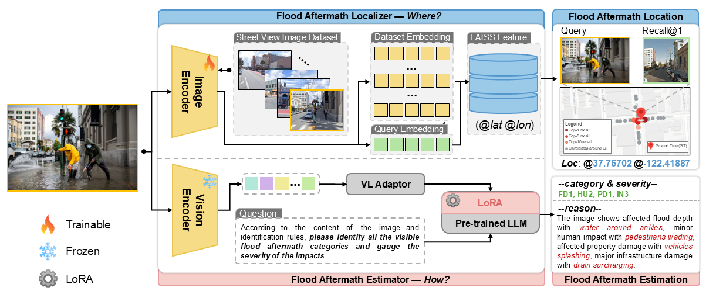
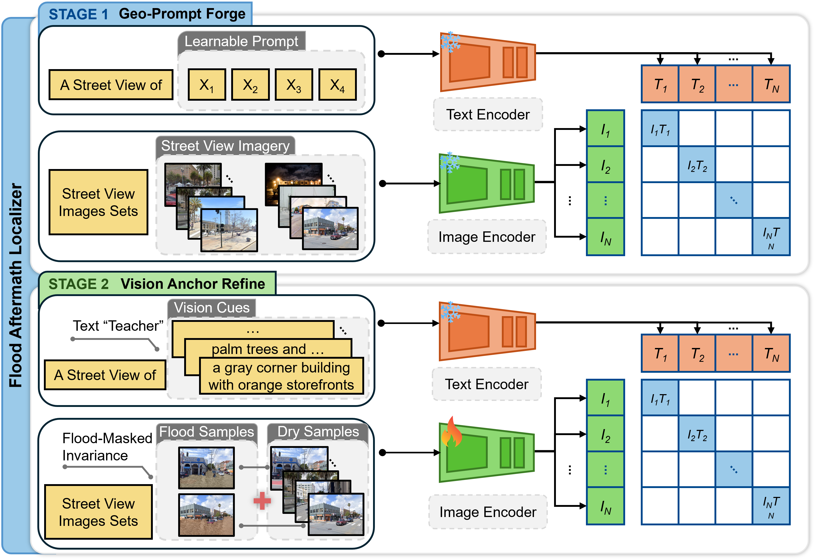
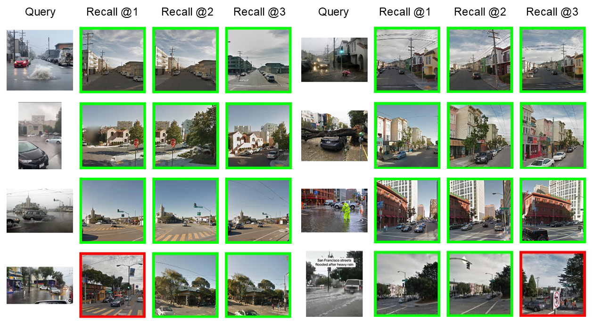
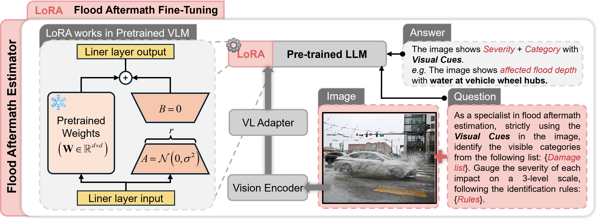

# FALE: Flood Aftermath Localization and Estimation

Official codebase for a two-part framework for image-based urban flood analysis:

- **FAL**: Flood Aftermath Localizer, a street-level geolocation model for flood-related imagery under severe appearance shift.
- **FAE**: Flood Aftermath Estimator, a visual-language flood impact assessment model fine-tuned with LoRA to predict multi-axis aftermath severity codes.

This repository is organized around the full pipeline:

1. **Where?** Localize a flood image to its most likely street location using large-scale street-view retrieval.
2. **How severe?** Estimate visible aftermath impacts from the localized image using a fine-tuned vision-language model.

<p align="center">
  
</p>

---

## Highlights

- Two-stage **Flood Aftermath Localizer (FAL)** tailored to flood-induced appearance changes.
- **Geo-Prompt Forge** for place-aware visual-text alignment.
- **Vision Anchor Refine** with online **Flood-Masked Invariance (FMI)** augmentation.
- **Flood Aftermath Estimator (FAE)** based on LoRA fine-tuning of a pretrained VLM.
- Retrieval evaluation with **Recall@K** and qualitative retrieval visualization.
- Multi-axis flood impact estimation across flood depth, human impact, property damage, building damage, infrastructure damage, economic disruption, and environmental debris.

---

## Repository structure

The current code is split into two modules:

```text
.
├── FAL/
│   ├── train_stage1.py
│   ├── train_stage2.py
│   ├── eval.py
│   ├── test.py
│   ├── parser.py
│   ├── augmentations.py
│   ├── commons.py
│   ├── util.py
│   ├── visualizations.py
│   ├── cosface_loss.py
│   ├── triplet_loss.py
│   ├── clip/
│   ├── cosplace_model/
│   └── datasets/
└── FAE/
    ├── run_flood_sft.py
    ├── GFA_train_85.jsonl
    ├── GFA_test_15.jsonl
    └── dataset_info.json
```

Recommended asset layout for the public GitHub repository:

```text
.
├── assets/
│   ├── overview.png
│   ├── FAL.png
│   ├── FAE.png
│   └── result1.png
├── FAL/
├── FAE/
├── README.md
├── requirements.txt
└── LICENSE
```

---

## Method overview

## FAL: Flood Aftermath Localizer

FAL is designed for **street-level localization of flood aftermath imagery**. Instead of assuming clean visual overlap between query and reference images, it explicitly addresses the appearance shift caused by floodwater, reflections, splashing, debris, and transient scene changes.

The training pipeline contains two stages.

### Stage 1: Geo-Prompt Forge

Stage 1 learns a **place-aware prompt space** using frozen CLIP image and text representations. The goal is to align each geographic class with a learnable textual prompt, so that the model captures stable place semantics rather than overfitting to superficial appearance.

<p align="center">
  
</p>

### Stage 2: Vision Anchor Refine

Stage 2 refines the image encoder for robust place recognition. It introduces:

- **visual cue anchoring**, using prompt-derived text features as semantic references;
- **classification and metric learning objectives**, including cosine-margin classification and optional triplet loss;
- **online Flood-Masked Invariance (FMI)**, which synthesizes flood-like perturbations and enforces invariance between dry and flood views from the same location.

This stage is the core mechanism that improves retrieval robustness under flood-induced domain shift.

### Retrieval output

Given a flood image query, FAL retrieves the most likely street-view locations from a large georeferenced database and evaluates them using **Recall@K**.

<p align="center">
  
</p>

Green borders indicate correct retrievals, and red borders indicate failure cases.

---

## FAE: Flood Aftermath Estimator

FAE is a **visual-language flood impact assessor** built on top of a pretrained VLM with **LoRA fine-tuning**. It predicts visible aftermath categories and their severity using a compact flood-specific coding system.

The current implementation uses a structured instruction-following setup with codes such as:

- `FD`: Flood Depth
- `HU`: Human Impact
- `PD`: Property Damage
- `BD`: Building Damage
- `IN`: Infrastructure Damage
- `EC`: Economic Disruption
- `EN`: Environmental Debris & Sediment

Each axis is scored on a 3-level severity scale, for example `FD2`, `IN3`, or `EN1`.

<p align="center">
  
</p>

The estimator is intended to answer the question: **what visible impacts are present in the image, and how severe are they?**

---

## Installation

## 1. Create the Python environment for FAL

```bash
conda create -n fale python=3.10 -y
conda activate fale
pip install -r FAL/requirements.txt
pip install torch torchvision tqdm utm scikit-learn pillow faiss-cpu
```

If you want GPU FAISS, replace `faiss-cpu` with the appropriate GPU build for your environment.

## 2. Additional dependencies for FAE

FAE uses `llamafactory-cli` and a pretrained Qwen2.5-VL checkpoint in the current training script. A typical setup is:

```bash
conda create -n fae python=3.10 -y
conda activate fae
pip install llamafactory
pip install transformers datasets accelerate peft pillow numpy
```

You should also make sure the base model path in `FAE/run_flood_sft.py` points to your local checkpoint:

```python
model_name_or_path="/path/to/Qwen2.5-VL-7B-Instruct"
```

---

## Data preparation

## FAL data format

The FAL code expects image filenames to encode geographic metadata in the file path, following the CosPlace-style convention used by the dataset loader.

### Training images

Training classes are constructed from image paths containing UTM and heading information. In `datasets/train_dataset.py`, class ids and groups are built from filename tokens extracted using `path.split("@")`.

The code expects image paths to contain at least:

- UTM east at token index `1`
- UTM north at token index `2`
- heading at token index `9`

A typical file naming convention therefore looks like:

```text
some_prefix@utm_east@utm_north@...@heading@image.jpg
```

### Test / evaluation images

For testing, the loader in `datasets/test_dataset.py` expects:

- database images in `database/`
- query images in `queries/` or `queries_v1/`
- UTM east and north embedded in the filename

Example layout:

```text
DATA_ROOT/
├── train/
├── val/
│   ├── database/
│   └── queries/
└── test/
    ├── database/
    ├── queries/
    └── queries_v1/
```

The default positive match threshold is controlled by:

```bash
--positive_dist_threshold 25
```

which means a retrieval is considered correct if it falls within 25 meters of a positive reference.

## FMI texture data

If you enable online FMI in Stage 2, you must provide a folder of water textures:

```bash
--online_fmi --fmi_water_dir /path/to/water_textures
```

Optional SegFormer-based road masking can also be enabled with:

```bash
--fmi_use_segformer
```

## FAE data format

The FAE training and test sets are currently stored as JSONL files in **ShareGPT-style multimodal format**.

Each example contains:

- `images`: a relative image path
- `messages`: a conversation with `system`, `user`, and `assistant` turns

Example:

```json
{
  "images": ["flood_image/Bing_0001 (10).jpeg"],
  "messages": [
    {"role": "system", "content": "..."},
    {"role": "user", "image": 0, "content": "<image> Identify visible flood impacts..."},
    {"role": "assistant", "content": "EN3"}
  ]
}
```

In the provided code:

- `GFA_train_85.jsonl` is the training split
- `GFA_test_15.jsonl` is the test split
- `dataset_info.json` stores LLaMA-Factory dataset registration metadata

---

## Quick start

## FAL stage 1 training

Stage 1 learns the prompt representations while keeping the visual encoder frozen.

```bash
cd FAL
CUDA_VISIBLE_DEVICES=0 python train_stage1.py \
  --backbone ViT-B-16 \
  --fc_output_dim 512 \
  --batch_size_stage1 512 \
  --epochs_num_stage1 480 \
  --train_set_folder /path/to/train \
  --test_set_folder /path/to/test \
  --save_dir fal_vitb16_stage1
```

Important notes:

- `--test_set_folder` is still required by the shared parser, even for training.
- The main output of Stage 1 is a saved prompt learner file such as:

```text
logs/<save_dir>/stage1/<timestamp>/last_prompt_learners.pth
```

## FAL stage 2 training

Stage 2 refines the image encoder using classification, image-text alignment, and optional triplet loss.

```bash
cd FAL
CUDA_VISIBLE_DEVICES=0 python train_stage2.py \
  --backbone ViT-B-16 \
  --fc_output_dim 512 \
  --batch_size 32 \
  --epochs_num 64 \
  --iterations_per_epoch 10000 \
  --lr 1e-5 \
  --classifiers_lr 1e-2 \
  --train_set_folder /path/to/train \
  --val_set_folder /path/to/val \
  --test_set_folder /path/to/test \
  --prompt_learners /path/to/last_prompt_learners.pth \
  --save_dir fal_vitb16_stage2 \
  --use_amp16 \
  --soft_triplet
```

### FAL stage 2 with online FMI

```bash
cd FAL
CUDA_VISIBLE_DEVICES=0 python train_stage2.py \
  --backbone ViT-B-16 \
  --fc_output_dim 512 \
  --batch_size 32 \
  --epochs_num 64 \
  --iterations_per_epoch 10000 \
  --train_set_folder /path/to/train \
  --val_set_folder /path/to/val \
  --test_set_folder /path/to/test \
  --prompt_learners /path/to/last_prompt_learners.pth \
  --save_dir fal_vitb16_fmi \
  --use_amp16 \
  --soft_triplet \
  --online_fmi \
  --paired_batch_ratio 0.5 \
  --pair_mode_dry_dry 0.1 \
  --pair_mode_dry_flood 0.8 \
  --pair_mode_flood_flood 0.1 \
  --fmi_water_dir /path/to/water_textures
```

The FMI-related arguments exposed in `parser.py` let you control water level, blending strength, reflection strength, edge preservation, wave perturbation, and mask dilation.

## FAL evaluation

```bash
cd FAL
CUDA_VISIBLE_DEVICES=0 python eval.py \
  --backbone ViT-B-16 \
  --fc_output_dim 512 \
  --resume_model /path/to/best_model.pth \
  --test_set_folder /path/to/test \
  --infer_batch_size 64 \
  --positive_dist_threshold 25
```

To save qualitative predictions:

```bash
cd FAL
CUDA_VISIBLE_DEVICES=0 python eval.py \
  --backbone ViT-B-16 \
  --fc_output_dim 512 \
  --resume_model /path/to/best_model.pth \
  --test_set_folder /path/to/test \
  --num_preds_to_save 3
```

This will report:

- `R@1`
- `R@5`
- `R@10`
- `R@20`

and optionally save qualitative retrieval results.

## FAE fine-tuning

The current FAE script performs stage-wise LoRA fine-tuning and evaluation.

In the provided code:

- base model: `Qwen2.5-VL-7B-Instruct`
- finetuning type: `LoRA`
- total epochs: `36`
- epochs per stage: `3`
- batch size per device: `2`
- gradient accumulation steps: `8`
- learning rate: `1e-5`

Run:

```bash
cd FAE
python run_flood_sft.py
```

The script will:

1. train for one stage;
2. locate the latest LoRA adapter directory;
3. run prediction on the test split;
4. compute macro and micro precision, recall, and F1;
5. repeat until all stages finish.

Output is saved under a directory like:

```text
saves/Qwen2.5-VL-7B-Instruct/lora/flood_<timestamp>/
```

---

## Main arguments

## FAL

Some of the most important arguments in `FAL/parser.py` are:

| Argument | Meaning |
|---|---|
| `--backbone` | CLIP backbone: `CLIP-RN50`, `CLIP-RN101`, `CLIP-ViT-B-16`, `CLIP-ViT-B-32` |
| `--fc_output_dim` | final descriptor dimension |
| `--train_set_folder` | training image root |
| `--val_set_folder` | validation set root |
| `--test_set_folder` | test set root |
| `--batch_size_stage1` | stage-1 batch size |
| `--epochs_num_stage1` | stage-1 epochs |
| `--batch_size` | stage-2 batch size |
| `--epochs_num` | stage-2 epochs |
| `--iterations_per_epoch` | stage-2 iterations per epoch |
| `--prompt_learners` | path to saved stage-1 prompt learners |
| `--online_fmi` | enable online FMI synthesis |
| `--fmi_water_dir` | folder of water textures |
| `--soft_triplet` | enable triplet loss |
| `--positive_dist_threshold` | positive radius in meters |
| `--num_preds_to_save` | number of retrieved predictions to save |

## FAE

The current `run_flood_sft.py` exposes its main hyperparameters as in-file constants and a `BASE_ARGS` dictionary rather than CLI flags. The ones you are most likely to change are:

- `model_name_or_path`
- `dataset`
- `val_size`
- `learning_rate`
- `per_device_train_batch_size`
- `gradient_accumulation_steps`
- `lora_rank`
- `lora_alpha`
- `freeze_vision_tower`
- `freeze_multi_modal_projector`
- `TOTAL_EPOCHS`
- `EPOCHS_PER_STAGE`
- `EVAL_DATASET`

---

## Outputs

## FAL outputs

Stage 1 output:

```text
logs/<save_dir>/stage1/<timestamp>/
├── last_prompt_learners.pth
└── prompt_learners_<epoch>.pth
```

Stage 2 output:

```text
logs/<save_dir>/stage2/<timestamp>/
├── best_model.pth
├── last_checkpoint.pth
├── model_<epoch>.pth
└── predictions/...
```

## FAE outputs

```text
saves/Qwen2.5-VL-7B-Instruct/lora/flood_<timestamp>/
├── epoch_3/
├── epoch_6/
├── ...
└── train.log
```

Each stage directory contains LoRA adapters and a `predict_test/` directory with `generated_predictions.jsonl` after inference.

---

## Reproducing the full FALE pipeline

A typical workflow is:

1. **Prepare the large-scale street-view reference dataset** for FAL.
2. **Train FAL Stage 1** to obtain prompt learners.
3. **Train FAL Stage 2** with or without FMI for flood-robust descriptors.
4. **Evaluate retrieval performance** using Recall@K and save qualitative examples.
5. **Prepare the GFA JSONL data** for FAE.
6. **Fine-tune the VLM with LoRA** using the flood aftermath coding scheme.
7. **Run FAE inference and evaluation** to obtain code-level prediction quality.
8. Combine the two modules so that a real-world flood image can first be localized and then assessed.

---

## Practical notes

- The FAL parser is shared across training and evaluation, so some arguments that look unnecessary may still be required.
- Stage 1 and Stage 2 currently rely on **saved prompt learners** as the bridge between the two stages.
- FAL assumes a **CosPlace-style filename metadata convention**. If your data naming differs, update the parsing logic in `datasets/train_dataset.py` and `datasets/test_dataset.py`.
- FAE currently assumes a local LLaMA-Factory workflow and a local Qwen2.5-VL checkpoint.
- If you release this publicly, add:
  - a `requirements_fae.txt` or `environment.yml`;
  - a small `scripts/` folder with reproducible shell commands;
  - public dataset access instructions;
  - pretrained checkpoint download links.

---

## Suggested GitHub cleanup before release

Before making the repository public, it is worth cleaning up a few things:

1. add a top-level `.gitignore`;
2. move the figures into `assets/`;
3. add `requirements_fae.txt` or a unified environment file;
4. remove `__pycache__` and notebook checkpoint folders;
5. rename dataset paths and hard-coded local paths into configurable arguments;
6. add `scripts/train_fal_stage1.sh`, `scripts/train_fal_stage2.sh`, `scripts/eval_fal.sh`, and `scripts/train_fae.sh`;
7. add a `Model Zoo` section when checkpoints are ready.

---

## Citation

If you use this codebase, please cite the corresponding paper once available:

```bibtex
@article{your_fale_paper,
  title   = {FALE: Flood Aftermath Localization and Estimation from Images},
  author  = {Author, A. and Author, B. and Author, C.},
  journal = {arXiv or Journal Name},
  year    = {2026}
}
```

You may also cite the localization and estimation modules separately if they are released as independent papers.

---

## Acknowledgements

This codebase builds on ideas from large-scale visual place recognition, CLIP-based representation learning, and LoRA-based multimodal fine-tuning. The public release can acknowledge upstream projects that inspired the implementation and engineering structure.

---

## Contact

For questions, issues, or collaboration, please open a GitHub issue or contact the corresponding author.
